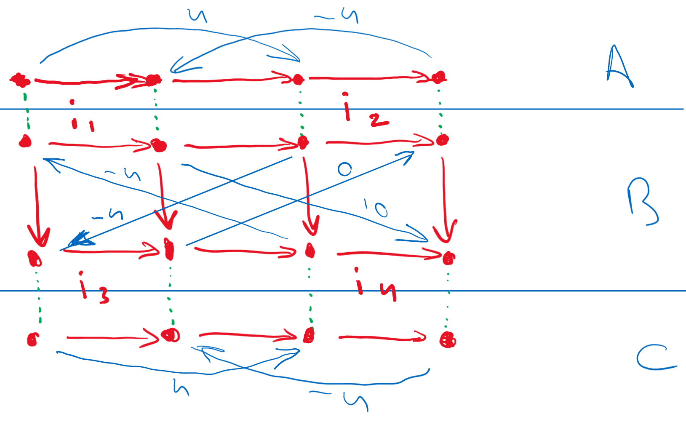

---
macros:
  Nats: "\\mathbb{N}"
  var: p
macros-latex:
  Smiley: ":-)"
macros-html:
  Smiley: "&#128540;"
...

# Title

This is an example document {{Smiley}}.

Lorem ipsum dolor sit amet, consectetur adipiscing elit, sed do eiusmod tempor incididunt ut labore et dolore magna aliqua. Ut enim ad minim veniam, quis nostrud exercitation ullamco laboris nisi ut aliquip ex ea commodo consequat. Duis aute irure dolor in reprehenderit in voluptate velit esse cillum dolore eu fugiat nulla pariatur. Excepteur sint occaecat cupidatat non proident, sunt in culpa qui officia deserunt mollit anim id est laborum.

Some math and macro definitions:
For all ${{var}}\in{{Nats}}$

$$\exists_{a\in{}{{Nats}}}[\exists_{b\in{}{{Nats}}}[\exists_{c\in{}{{Nats}}}[a^3+b^3=c^3]]]$${#eq:fermat}

See Equation @eq:fermat

A lemma and a theorem with cross referencing

::::: {.lemma label="lem:something"}
This is an example lemma.
:::::

::::: {.theorem label="thm:athm"}
This is an example theorem using Lemma @lem:something.
:::::

A floating figure in fig @fig:float.

{label="fig:float" scale=0.25}

An inline figure.

{.inline scale=0.25}

A table:

 A   B
--- ---
 0   1
 2   3
 4   5

<!-- refer to bib file in the make.ps script call -->
This is a reference: [@Nor12]

<!-- markdownlint-disable-file MD041 MD035 -->