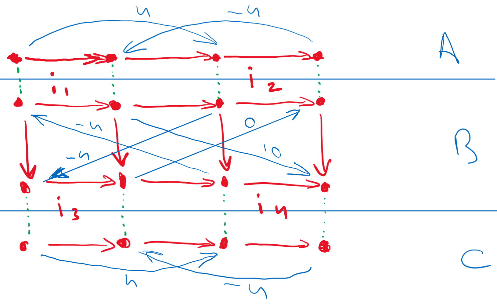

---
title-slide-attributes:
    background: title.html
slide-attributes:
    background: content.html
---

# Title {.title}

Marc Geilen

Electronic Systems, Dept. Electrical Engineering,\
Eindhoven university of Technology

[m.c.w.geilen@tue.nl](m.c.w.geilen@tue.nl)

::: footnote

> This work has received funding from the Electronic Component Systems for European Leadership (ECSEL) Joint Undertaking under grant agreement no 783162 (FitOpTiVis) and 101007260 (TRANSACT)

:::

# Overview

- Item 1
- Item 2
- Item 3
- Item 4

# Instructions

- laser pointer
- chalk

# Text with image

TODO: make default background iframe

- a
- b

::: center
{style="width: 500px;"}
:::

# Animated List

::: incremental

- Item 1
- Item 2
- Item 3

:::

# Two columns

:::::::::::::: {.columns}
::: {.column width="60%"}

- 60%

:::
::: {.column width="40%"}

- 40%

:::
::::::::::::::

# CSS styling

:::{style="background: blue; color: white; transform: rotate(180deg);"}

- Item 1
- Item 2

:::

# A table with empty background {background="empty.html"}

Header left                         Header center
--------------------------------  -----------------
Natural numbers                   ${{Nats}}$
Rational numbers                  ${{Rationals}}$

# A Scatter Plot

::::: {.scatterchart
  style='position: relative; left:20px; top:20px; height:320px; width:320px; background-color: white; margin-left:auto; margin-right: auto;'
  rangeX='0:30'
  rangeY='0:30'
  data='[
        (10,18),(13,15),(15,10)
    ],[
        (11,19),(17,17)
    ]'
  labels='"Pareto Points","Dominated Points"'
  colors='rgba(255,0,0,.8),rgba(0,0,255,.8)'
  dotSizes='7,7'
  }
:::::

# A `charts.js` chart

::::: {.chart style="height:480px; width:640px; background-color: white;"}
<!--
{
  "options": {
    "scales": {
      "x": {
        "type": "linear",
        "min": 0,
        "max": 50,
        "ticks": {
            "font": {
                "size": 24,
                "weight": "bold"
            },
            "color": "black"
        }
      },
      "y": {
        "type": "linear",
        "min": 0,
        "max": 20,
        "ticks": {
            "font": {
                "size": 24,
                "weight": "bold"
            },
            "color": "black"
        }
      }
    },
    "plugins": {
      "legend": {
        "display": false
      }
    }
  },
  "data": {
    "datasets":[
      {
        "data":[{"x": 10, "y": 18}, {"x": 15, "y": 10}],
        "backgroundColor":"rgba(255,0,0,.8)",
        "pointRadius": 10, "pointHoverRadius": 20
      },
      {
        "data":[{"x": 11, "y": 19}, {"x": 17, "y": 17}],
        "backgroundColor":"rgba(0,0,255,.8)",
        "pointRadius": 10, "pointHoverRadius": 20
      }
    ]
  }
}
-->
:::::

# Text Boxes Arrows and Speech Bubbles

- scale title to always fit one line

:::: fragment
::: {.text-box x="0%" y="18%" font-size="smaller"}
[encoding qualities\
bandwidth requirements]{.hl}
:::
::: {.arrow x1="10" y1="20" x2="15" y2="35" width="10" color="#4472C4"}
:::
::::

:::: fragment
::: {.text-box x="30%" y="63%" font-size="smaller"}
[available bandwidth]{.hl}
:::
:::{.arrow x1="43" y1="65" x2="48" y2="50" width="10" color="#4472C4"}
:::
::::

:::: fragment
::: {.text-box x="40%" y="13%" font-size="smaller"}
[decoding streams of different quality\
computational effort required]{.hl}
:::
:::{.arrow x1="67" y1="15" x2="77" y2="32" width="10" color="#4472C4"}
:::
::::

:::: fragment
::: {.text-box x="50%" y="77%" font-size="smaller"}
[different levels of computation power\
different levels of energy consumption]{.hl}
:::
:::{.arrow x1="70" y1="84" x2="80" y2="60" width="10" color="#4472C4"}
:::
::::

:::: {.speech-bubble x="35%" y="10%" .fragment font-size="smaller"}
what is the optimal configuration?

- given communication bandwidth
- given battery status
- given user preferences

::::

:::: {.speech-bubble x="15%" y="65%" .fragment font-size="smaller"}
combines

- off-line profiling
- run-time combination
- run-time decision making

::::

::: {.spotlight x="52.75" y="25" r="3" color="yellow" gamma="50"}
:::

# An Image Popup

# Auto-Animation between Slides

- if need, explicitly identify parts

<!-- markdownlint-disable-file MD024 MD025 MD041 MD035 MD045 -->
