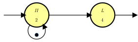
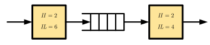
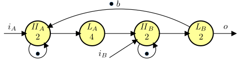
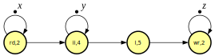
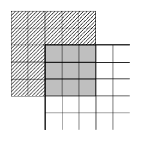
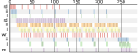

---
title-slide-attributes:
    background: convolve-title.html
slide-attributes:
    background: convolve-content.html
include-css: [
  "./styles/convolve.css"
  ]
macros:
  Nats: "\\mathbb{N}"
  Rationals: "\\mathbb{Q}"
  "actorname#1": "\\textsf{#1}"
  "mi": "{-\\infty}"
  period: "\\mu{}"
  "mpmatrix#1": "{\\textrm{\\bf{}#1}}"
  ri: "\\textrm{\\bf{}A}_{\\mathit{ri}}"
  cm: "\\textrm{\\bf{}A}_{\\mathit{cm}}"
  ro: "\\textrm{\\bf{}A}_{\\mathit{ro}}"
---

# Title {.title}

Marc Geilen

Electronic Systems, Dept. Electrical Engineering,\
Eindhoven university of Technology

[m.c.w.geilen@tue.nl](m.c.w.geilen@tue.nl)

# Context & Objectives

- WP6 Design space exploration
- analysis techniques to assess performance of a proposed mapping
- feedback about bottlenecks or critical paths
  - to support exploration

# Dataflow

- a mathematical model of activities and dependencies

{.zoom-image}

# Max-plus

- a linear algebra for logistics
  $$x \oplus y \otimes z = \max(x, y+z)$$

# Example HLS

{ .zoom-image}
{ .zoom-image}

# Gantt chart (1)

{ .zoom-image}

# Gantt chart (2)

{ .zoom-image}

# Gantt chart (3)

{ .zoom-image}

# Matrix formula

Linear system with state matrix:

$$
A =
\begin{pmatrix}
2      & {{mi}} & 2      & {{mi}} & {{mi}} & {{mi}} \\
8      & 2      & 8      & {{mi}} & {{mi}} & {{mi}} \\
{{mi}} & {{mi}} & {{mi}} & 0      & {{mi}} & {{mi}} \\
{{mi}} & {{mi}} & {{mi}} & {{mi}} & 0      & {{mi}} \\
{{mi}} & {{mi}} & {{mi}} & {{mi}} & {{mi}} & 0      \\
10     & 4      & 10     & {{mi}} & {{mi}} & {{mi}} \\
\end{pmatrix}
$$

# Performance analysis

- Throughput is $\frac{1}{\lambda}$ iff $\lambda$ is the largest eigenvalue of the matrix
- Latency can be computed from state space matrices
  $$\Lambda= {{mpmatrix{A}}} {\left( {-{{period}}}\otimes{}{{mpmatrix{B}}}\right)}^* \oplus {{mpmatrix{D}}}$$

- Throughput is $\frac{2}{5}$
- Latency for $i_A\rightarrow{}o$ is $10$
- Latency for $i_B\rightarrow{}o$ is $4$

# Feedback critical path

- analysis provides performance numbers
- models allow (automatic) exploration of trade-offs between resource allocation and performance
  - e.g., buffer size vs throughput

- feedback about performance bottleneck may provide guidance for design-space exploration.

# Dynamism

- multi-rate
- varying delays
- phases

{ .zoom-image}
{ .zoom-image}

 mode   rd   ii   l    wr
------ ---- ---- ---- ----
 ri     2    2    0    0
 cm     2    4    5    2
 ro     0    3    4    2

# Gantt

{ .zoom-image style="width: 90%;"}

# Compositionality

Computing the overall max-plus matrix is still efficient.

$$
{{ri}}^6
\left({{ri}} {{cm}}^6 {{ro}}\right)^8
{{ri}}^6
$$

::: .footnote
van der Vlugt, S., Alizadeh Ara, H., de Jong, R. et al. Modeling and Analysis of FPGA Accelerators for Real-Time Streaming Video Processing in the Healthcare Domain. J Sign Process Syst 91, 75–91 (2019). <https://doi.org/10.1007/s11265-018-1414-3>
:::

# Demo

<http://computationalmodeling.info/cmwb>
<http://www.es.ele.tue.nl/sdf3>

# Notes

- TU/e has traditionally focussed on the fundamental modelling and analysis side for its tools
- Specific applications to design-flows have sometimes been more ad-hoc

# Questions for the Meeting (1/3)

*What is the **design-space** we are considering (at the SoC level)?*

- Architecture?
  - Co-processor instructions; accelerator attached to local cross-bar; accelerator tile via shared memory
- Mapping?
  - Of what? CNN Layers, general processes, functions, accelerators?
  - Loop transformations; layer fusion?
- Other aspects
  - resource dimensioning? buffer sizes? network parameters?
  - Application side configurations or parameters?

# Questions for the Meeting (2/3)

*What are the optimization **objectives**?*

- Performance
  - latency and/or throughput?
- Energy-efficiency, area, cost?
- Application quality?
- Is multi-objective optimization relevant?
  - Final outcome a single solution, or a set of of Pareto optimal solutions?
- What exactly is the outcome?
  - How does it feed into the tool flow?

# Questions for the Meeting (3/3)

- How to evaluate candidate solutions?
  - At what level of abstraction?
- What aspects do we need to capture in models for DSE
  - performance, execution time, latency, throughput, power, security, cost, …?)
- can MLIR abstractions be a way to achieve some integration / automation with compiler tool chains?
- Level of integration to pursue
  - *In favor of loosely coupled baseline*
  - With potential 'bonus' further integration

# Almarvi

:::: {.columns}
::: {.column width="50%"}

Previous work

- Performance modelling of a multi-scale filter
- HLS generated
- Streaming, data driven execution
- FIFOs with back-pressure
- Throughput and latency prediction
- Buffer sizing study

:::
::: {.column width="50%"}

{.zoom-image width="500px"}
{.zoom-image width="500px"}

:::
::::

# Almarvi

::: center
{.zoom-image width="500px"}
:::

# Almarvi

::: center
{.zoom-image width="500px"}
:::

# Almarvi

HLS output

- Initiation Interval (`II`)
- Iteration Latency (`IL`)
- Trip Count (`TC`)
  
::: center
{.zoom-image width="500px"}
:::

# Almarvi

Dataflow model of a single component capturing Initiation Interval (`II`) and Latency (`IL`)
  
::: center
{.zoom-image width="500px"}
:::

::: {.small}

+--------+-----+-+-+-+-+-+----------------+--+-+---+
|Phase   |Rates| | | | | |Execution Times |  | |   |
+========+=====+=+=+=+=+=+================+==+=+===+
|        |a    |b|c|d|e|f|src             |ii|l|snk|
+--------+-----+-+-+-+-+-+----------------+--+-+---+
|rush-in |1    |1|1|1|0|0|1               |1 |0|1  |
+--------+-----+-+-+-+-+-+----------------+--+-+---+
|process |1    |1|1|1|1|1|1               |2 |0|1  |
+--------+-----+-+-+-+-+-+----------------+--+-+---+
|rush-out|0    |0|1|1|1|1|1               |1 |0|1  |
+--------+-----+-+-+-+-+-+----------------+--+-+---+

:::

# Almarvi

Data dependencies
  
::: center
{.zoom-image width="500px"}
:::

# Almarvi

- Composing dataflow graphs
- Exploiting regular patterns
  - rush-in, rush-out at different levels, frame, line

$$((ri)^{2W}((ri)^2(cm)^{W-2}(ro)^2)^{H-2}(ro)^{2W})^{\omega}$$

::: center
{.zoom-image width="700px"}
{.zoom-image width="300px"}
:::

# Almarvi

- Optimizing buffer sizes
- Latency vs throughput vs. buffers (Block RAM)

::: center
{.zoom-image width="300px"}
:::

# Dataflow

- Streaming WH accelerators
- Apply to memory mapped 'transactional' accelerators?
  - to determine latency
- Parallel software implementations?
  - (With internal special instructions?)
- Network communication modelling?
- Memory hierarchy / controller modelling?
- Dynamic behavior?

# Multi-Objective Optimization

- Zigzag computes Pareto fronts?
  - energy, performance, area?
  - Pareto Algebra [1,2]
  - QRML [3]
    - <https://qrml.org>

::: footnote

1. M. Geilen, T. Basten, B. Theelen, and R. Otten, “An algebra of pareto points,” Fundam. inf., vol. 78, iss. 1, p. 35–74, 2007.
2. M. Geilen and T. Basten, “A calculator for pareto points,” in 2007 design, automation test in europe conference exhibition, 2007, pp. 1-6.
3. Martijn Hendriks, Marc Geilen, Kees Goossens, Rob de Jong, Twan Basten - Interface Modeling for Quality and Resource Management Logical Methods in Computer Science, May 26, 2021, Volume 17, Issue 2

:::

# Integration Opportunities

(How) can our works be connected?

- Dataflow based performance analysis/prediction inside DSE search?
- (Multi-Objective DSE?)

# Possible Challenges

- generalization beyond convolutional layers?
  - needed? possible?
  - level of generality required?
  - domain-specific solutions?
- unpredictable architectures

# Possible Approaches

- Analyze individual accelerator performance with dataflow methods; aggregate to system level models / predictions
- Analyze application-level performance?
- Derive approximate analytical models (ML models) from instances analyzed in detail with dataflow methods (or other methods)
  
# Tools

- SDF^3^ \
  <https://www.es.ele.tue.nl/sdf3>
- Computational Modeling Workbench \
  <https://computationalmodeling.info/cmwb> \
  <https://github.com/Model-Based-Design-Lab/cmwb>

# Workshop Discussion / Presentation / Tutorial {.fit}

- Hands-on useful?
- Explain about dataflow / Almarvi example
- Demo
- Spend time on discussion / road map / expected outcomes

# WP6 Kick-off TUE {.title}

Marc Geilen, Sander Stuijk\
Electronic Systems, Dept. Electrical Engineering,\
Eindhoven university of Technology
[m.c.w.geilen@tue.nl](m.c.w.geilen@tue.nl)\
25-1-2023

# TUE activities in the project

<!-- A slide with what you want to do in the project, with a rough timeline -->

- *"compositional models for performance analysis"*
- Lead T6.2 *Performance analysis and management of ML Applications on Modular Architectures*, M18 deliverable
- Make models of relevant NN components
  - Using timed dataflow models
- Implement relevant compositional anlysis methods
  - Targeting performance analysis: throughput / latency
  - Feedback about bottlenecks
- Integrate analysis methods into effective DSE methods / run-time (re)configuration

# Current / past work

<!-- A slide with what you are currently working on towards this goal (optional) -->

- Recruitment ongoing, PhD student starting in Feb.
- Developed performance anlysis techniques based on timed dataflow models and max-plus linear algebra
- Developed open-source analysis tools
  - SDF^3^, <https://www.es.ele.tue.nl/sdf3>
- Modelling of streaming HLS generated accelerators
- Design-flows and optimization / DSE methods
  - Multi-objective optimization, monotonic optimization
- Exploration of trade-offs between buffer sizes and performance
  - Identification of buffer bottlenecks and critical path dependencies

# Provide to / expect from others

<!-- A slide with what you need/expect from others, and when -->

- provide compositional performance analysis methods and tools
  - possible tutorial / demo / presentation in Feb workshop
- need more detailed understanding of the proposed architecture template and considered accelerator types
- we are open to opportunities for integration into
  - compilation or synthesis flows
  - Design-Space Exploration methods or tools
- others to tackle other aspects
  - such as power models, fault-tolerance, ...

<!-- markdownlint-disable-file MD024 MD025 MD041 MD035 MD045 -->
