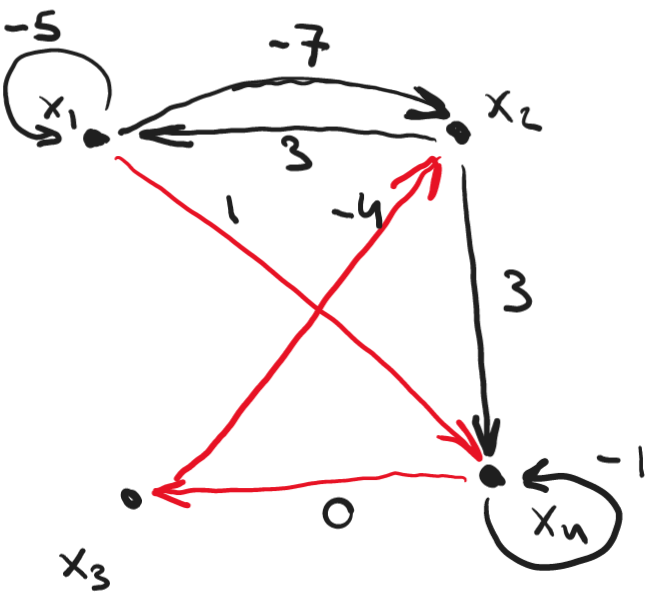

This is a preamble text to introduce the document

<!-- Questions start below -->

::: {.problems}

::: {.problem descriptor="Probl." name="Dataflow Graphs and Max-Plus Algebra" points="27" }

::: {.question}

Consider the following Timed Dataflow Graph.

{.inline scale=0.8}
  
a. (2 pts)
   Make the graph deadlock free by adding **one** initial token to a channel.
  
b. (3 pts)
   Give a valid schedule $\sigma$ for the first **two** iterations of the new graph, including the added token, assuming that the added initial token is available at time 0 and such that the makespan of the schedule is at most $26$.

c. (2 pts)
   Does the schedule $\sigma$ have a throughput value for Actor ${{actorname{A}}}$? If yes, determine the throughput. If no, explain why we cannot assign a throughput value to the schedule.

d. (5 pts)
   Compute the following max-plus algebra expressions:
   $$[-10, {{mi}}]^2$$
   $$0 {{otimes}} [5, 10, 15]$$
   $$[0, 4, 8, 12] {{otimes}} [10, 10, 20, 20]$$
   $$
     \left(
        {{mpvectorthree{2}{12}{5}}},
        {{mpvectorthree{2}{{{mi}}}{-5}}}
     \right)
   $$
   $$
     {{mpmatrixthreetwo{3}{5}{{{mi}}}{-1}{-5}{{{mi}}}}}
     {{mpvectortwo{0}{{{mi}}}}}
   $$

e. (5 pts)
   Consider a max-plus-linear and index-invariant system $S$ with two inputs $i_1$ and $i_2$ and a single output $o$.
   The *impulse responses* of $S$ are
   $$ h_{i_1,o} = [3, 6, 9, 12, 15, 18, \ldots{}]$$
   $$ h_{i_2,o} = [10, 10, 10, {{mi}}, {{mi}}, {{mi}}, \ldots{}]$$

   If input $i_1$ to system $S$ is equal to
   $$i_1=[8,9,10,11,12]$$
   and input $i_2$ to system $S$ is equal to
   $$i_2=[4, 4, 8, 8, 12]$$
   compute the output event sequence $o$ such that
   $$i_1, i_2{{systemio{S}}}o$$

f. (4 pts)
   Let input $i'_2$ to system $S$ of the previous item be equal to
   $$i'_2 = i_2 {{oplus}} [{{mi}}, {{mi}}, 10, {{mi}}, {{mi}}]$$
   Use the results from Item e and the superposition principle to determine the output event sequence $o'$  such that
   $$i_1, i'_2{{systemio{S}}}o'$$

g. (6 pts)
   Consider the following max-plus matrix ${{mpmatrix{M}}}$.

   $$ {{mpmatrix{M}}} = {{mpmatrixfourfour{0}{8}{{{mi}}}{{{mi}}}{-2}{{{mi}}}{1}{{{mi}}}{{{mi}}}{{{mi}}}{{{mi}}}{5}{6}{8}{{{mi}}}{3}}} $$

   Determine the largest eigenvalue of the matrix  ${{mpmatrix{M}}}$ and determine
   a normal eigenvector for this eigenvalue.

:::

::: {.answer ref="exam23frb-comprot"}

## Answers {-}

a. (2 pts)
   An initial token is needed on every cycle to make the graph deadlock free. We can add only one token. We must place it on the channel that is shared by both cycles, the edge from Actor ${{actorname{B}}}$ to Actor ${{actorname{A}}}$.

   ::::: { .grading }
   [for adding a token that makes the graph deadlock free.]{.criterion points="2"}
   :::::

b. (3 pts)
   The following is such a schedule. Note that the two firings of Actor ${{actorname{C}}}$ have to be concurrent to achieve the makespan constraint.

   -----------------------------------   ------------------------------------
    $\sigma({{actorname{A}}}, 0) = 0$     $\sigma({{actorname{A}}}, 1) = 16$
    $\sigma({{actorname{B}}}, 0) = 15$    $\sigma({{actorname{B}}}, 1) = 24$
    $\sigma({{actorname{C}}}, 0) = 0$     $\sigma({{actorname{C}}}, 1) = 0$
    $\sigma({{actorname{D}}}, 0) = 12$    $\sigma({{actorname{D}}}, 0) = 21$
   -----------------------------------   ------------------------------------

   ::::: { .grading }
   [for a valid schedule.]{.criterion points="1.5"}
   [for a schedule with makespan at most 26.]{.criterion points="1.5"}
   :::::

c. (2 pts)
   The schedule does not have a throughput value for Actor ${{actorname{A}}}$, since the actor fires only a finite number of times.

   ::::: { .grading }
   [for the correct answer.]{.criterion points="2"}
   :::::

d. (5 pts)
   The results are:
   $$[{{mi}}, {{mi}}, -10, {{mi}}]$$
   $$[5, 10, 15]$$
   $$[10, 14, 20, 24]$$
   $$ 4 $$
   $$ {{mpvectorthree{3}{{{mi}}}{-5}}} $$

   ::::: { .grading }
   [for correct expression 1.]{.criterion points="1"}
   [for correct expression 2.]{.criterion points="1"}
   [for correct expression 3.]{.criterion points="1"}
   [for correct expression 4.]{.criterion points="1"}
   [for correct expression 5.]{.criterion points="1"}
   :::::

e. (5 pts)
   The result is the maximum of the convolutions of each of the inputs and the corresponding impulse responses:

   $[8,9,10,11,12]{{otimes}}[3,6,9,12,15] {{oplus}} [4,4,8,8,12]{{otimes}}[10,10,10,{{mi}},{{mi}}]$

   $= [11,14,17,20, 23] {{oplus}} [14, 14, 18, 18, 22]$

   $= [11, 14, 18, 20, 23]$

   ::::: { .grading }
   [for knowing that the output is the convolution between input and impulse response.]{.criterion points="2"}
   [for correctly computed responses for the individual inputs.]{.criterion points="2"}
   [for a correctly computed output.]{.criterion points="1"}
   :::::

f. (4 pts)
   From the superposition principle we know that $o' = o{{oplus}} o''$, where
   $$\epsilon, [{{mi}}, {{mi}}, 10, {{mi}}, {{mi}}] {{systemio{S}}} o''$$
   $$o'' = [{{mi}}, {{mi}}, 10, {{mi}}, {{mi}}]{{otimes}}[10, 10, 10, {{mi}}, {{mi}}]$$
   $$o'' = [{{mi}}, {{mi}}, 20, 20, 20]$$
   $$o' = [11, 14, 18, 20, 23]{{oplus}}[{{mi}}, {{mi}}, 20, 20, 20] = [11, 14, 20, 20, 23]$$

   ::::: { .grading }
   [for a valid application of the superposition principle.]{.criterion points="2"}
   [for a correctly computed result.]{.criterion points="2"}
   :::::

g. (6 pts)
   The precedence graph of the matrix ${{mpmatrix{M}}}$ is shown below on the left. The red cycle is the cycle with the Maximum Cycle Mean, which is 5. Hence the largest eigenvalue is 5. On the right the precedence graph of $-\lambda{{otimes}}{{mpmatrix{M}}}$ is shown.

   {.inline scale=0.5}
   {.inline scale=0.5}

   Determining the longest paths starting from node $x_1$ on the critical cycle leads to the eigenvector $[0~-3~1~1]^T$. The corresponding normal eigenvector is $[-1~-4~0~0]^T$.

   ::::: { .grading }
   [for the correct precedence graph of ${{mpmatrix{M}}}$.]{.criterion points="2"}
   [for a correctly identified MCM / eigenvalue.]{.criterion points="1"}
   [for the precedence graph of $-\lambda{{otimes}}{}{{mpmatrix{M}}}$.]{.criterion points="1"}
   [for a correct eigenvector.]{.criterion points="1"}
   [for a normal eigenvector.]{.criterion points="1"}
   :::::

:::

:::

:::

<!-- markdownlint-disable-file MD045 -->
